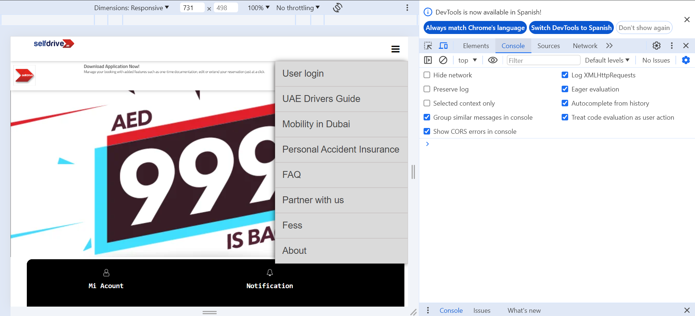
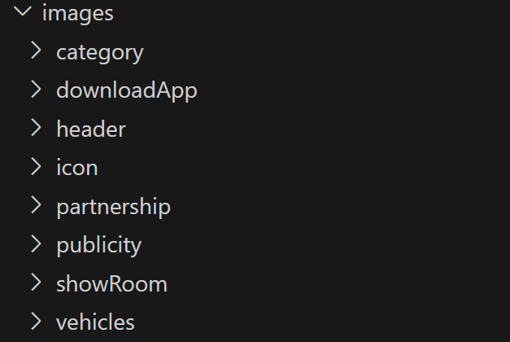
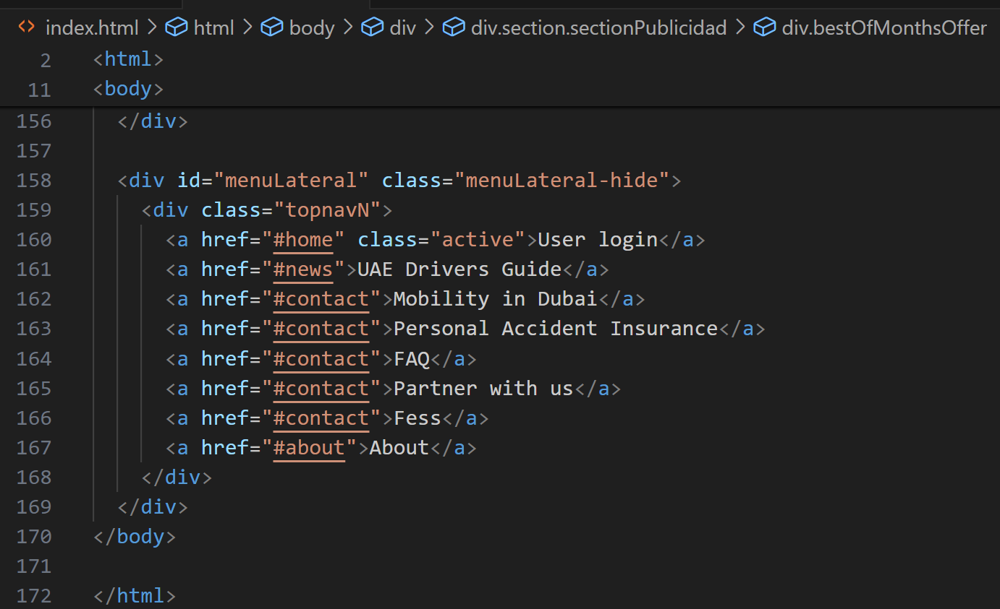
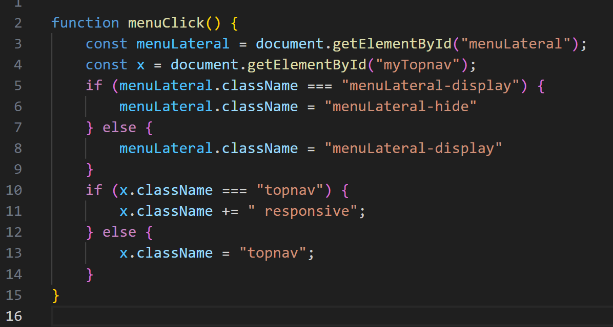
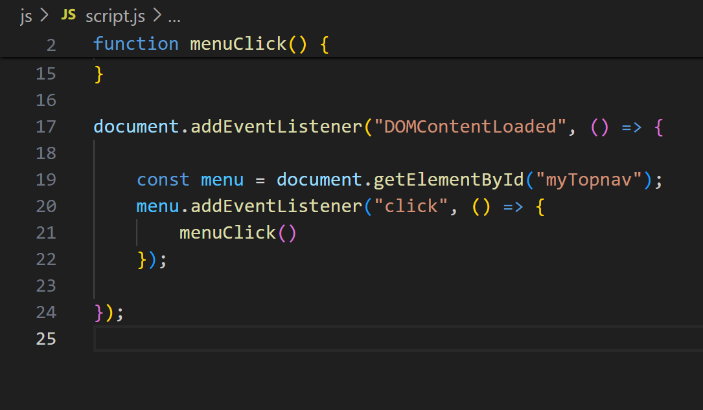

# SelfDrive
In this advance, work was done only in the Home:  

## Zero console errors:

## Project images:  

## Clean HTML, without CSS or Javascript code in line 

## Call function to side menu

## The javascript code is executed after loading the HTML

## What's missing:  
<ul>
<li>Responsive design for tablets and mobiles.</li>
<li>Define a Json structure.</li>
<li>Javascript programming.</li>
</ul>

## Next steps:  
<ul>
<li>Business model design.</li>
<li>Database design and development.</li>
<li>Backend development.</li>
<li>Project integration.</li>
</ul>
